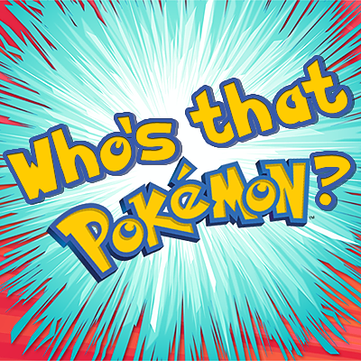
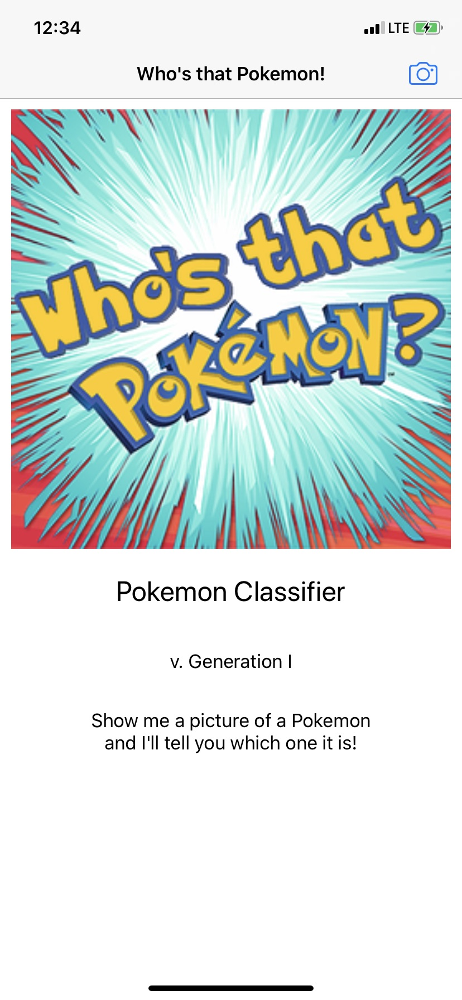

# Who's That Pokemon!

Pokemon Image Classifier for iPhones!

Give it a picture of the Generation 1 Pokemons and AI will tell you what Pokemon it is!

## How it Looks

### TODOS
Make image picker do both photo library and camera

Train better ML models

## Resources
AlamoFire

SwiftyJSON

Pokemon Go Twitter

https://pokemongo.fandom.com/wiki/Types

https://pokeapi.co/

https://www.kaggle.com/thedagger/pokemon-generation-one
